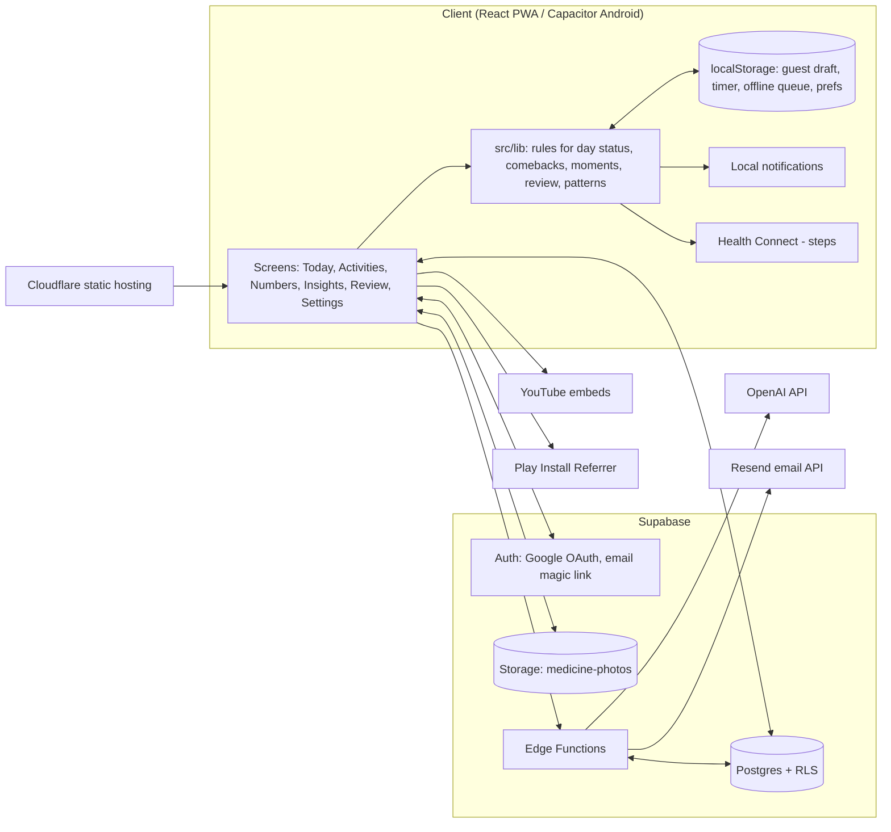

# Resuming — Design Document

Status: describes the code as of October 2026 (latest migration `20261011120000_reminder_emails.sql`).
Phase plans for upcoming work live in `docs/PHASE-*.md`.

---

## 1. What Resuming is

Resuming (resuming.me, Android app id `com.cheerfulgames.resuming`) is a quiet, no-shame habit and health tracker.
Its main idea is that **starting again is the skill**. A missed day is never a "failure"; the app
watches for quiet stretches and makes the next step smaller instead of showing a broken streak.

One **Today** screen brings together four kinds of items:

| Kind | What it is | Table |
|---|---|---|
| Activity (habit) | Something you do: walk, read, pranayam, a deadline task | `activities` + `log_entries` |
| Vital (number) | Something you measure: weight, blood pressure, steps | `metrics` + `metric_entries` |
| Medicine | A bottle with days and times, and a taken log | `medicines`, `medicine_times`, `medicine_doses` |
| Reminder | One thing on one day, optionally at a time | `reminders` |

### Platforms

- **Web / PWA** — React 19 + Vite, hosted on Cloudflare (static assets, SPA routing, `wrangler.toml`).
- **Android** — the same web build wrapped with Capacitor 7 (local notifications, Health Connect, splash, status bar, install referrer).
- **Guest mode** — the full Today experience works without an account; data lives in `localStorage` for 7 days and is merged into the account on sign-in.

---

## 2. Architecture



Design rules that show up everywhere in the code:

- **Business rules run on the client** (`src/lib/*.ts`, all unit-tested). The server-side weekly review email imports the same `buildWeeklyReview` function, so the in-app card and the email always agree.
- **Row Level Security on every user table**: `auth.uid() = user_id`. Admin-only reads go through `is_current_user_admin()`.
- **Server jobs are `security definer` SQL functions** (`due_checkins`, `due_birthday_emails`, `due_reminder_emails`, `users_due_for_weekly_review`) callable only by the service role, invoked hourly by Edge Functions.
- **Offline first**: timer state survives tab close, sessions queue offline and sync on reconnect, Today is cached (`todayCache.ts`).

---

## 3. Feature list

### 3.1 Getting started

- **Landing page** with explainer and pattern diagram; public About, Privacy, Terms, Feedback, Delete account pages.
- **Language picker on first open**: English, Hindi, Telugu, Gujarati, Marathi, Tamil (`src/lib/messages/*`), with Noto fonts for each script.
- **Guided start flow** (`/start`, `StartFlow.tsx`) without an account:
  - Pick habits from a catalog of 29 templates (reading, walk, running, exercise, meditate, stretching, water, protein, fasting, sleep, weight, steps, blood pressure, heart rate, journaling, writing, study, language, music, painting, dancing, four pranayams, rejuvenation, prayer, relaxation), or type your own.
  - Typed habits are classified locally first; the AI service refines them (see section 6).
  - Pick a size (minutes, glasses, grams, step goal), when you usually slip, a daily reminder time, medicines, and reminders.
  - A first timed session can be run inside onboarding.
- **Sign in** with Google OAuth or an email magic link. On Android, Google sign-in returns through the `com.cheerfulgames.resuming://auth/callback` deep link.
- **Guest draft merge**: after sign-in, `merge_guest_draft(payload)` copies guest activities, logs, readings, medicines, and reminders into the account once (idempotent via `profiles.merged_guest_id`).

### 3.2 Today screen

- Items grouped by **Morning / Afternoon / Evening / Anytime**, then ordered medicine → activity → reminder → vital, then by clock time.
- Colour accent per item kind; the part of the day turns **red-tinted once it is over** (re-checked every minute).
- Finished items fold into a **"Done today"** line.
- Activity actions depend on tracking mode:
  - **Timer**: Start, Pause, Resume, Stop; sessions add up across the day; "Log minutes" for manual entry; walking and exercise bouts stack.
  - **Count**: +1, 1 glass, +5 g protein, +4 hours fasting; protein and fasting can go past the goal.
  - **Checkbox**: Done / Undo.
  - **Deadline**: Complete, with days remaining; an overdue prompt offers Complete or Reschedule.
- **More menu**: Skip today (with reason chip: Too tired, No time, Didn't feel like it, Other), Rest today (whole day off), Pause this habit (1 week, 2 weeks, until I resume), Make it smaller (1 or 2 minutes) while a timer runs.
- **Follow-along videos** (YouTube embeds) for pranayam and workout templates, auto-playing with the timer.
- **Steps card** reads today's steps from Android Health Connect.
- **Vitals**: quick log or update today's value; blood pressure takes upper and lower.
- **Medicines**: one row per due dose with a Done button.
- **Reminders**: Done, Move to another day, Edit; Undo toast after Done.

### 3.3 Activities

- Types: `daily`, `weekly_n` (N times a week), `monthly`, `deadline`.
- Tracking: `timer`, `count`, `checkbox`.
- Off weekdays per activity, "why it matters" (≤ 80 chars), "usually when" (part of day).
- Target changes are versioned in `activity_target_history`, so old days are judged against the old target.
- Archive / unarchive, permanent delete.
- **Activity detail**: streak, quiet counts, average session, history with edit/delete, insight chart.
- **Break this down** (deadline activities): three AI micro-steps. The client is built, but the AI endpoint is not wired yet (section 6).

### 3.4 Numbers (vitals)

- Name, emoji, unit, optional catalog template; archive and delete.
- One entry per metric per day (`unique(metric_id, date)`), with an optional `secondary_value` for blood pressure.
- Detail screen: 7 / 30 / 90-day trend with min, max, average, change.

### 3.5 Medicines

- A bottle name (≤ 40 chars), optional **photo** (private `medicine-photos` bucket, one folder per user), weekdays, and system (homeopathic, allopathic, Ayurvedic). An Ayurvedic medicine catalog helps with names.
- Several times a day, each with before / after / with food.
- Taken log per dose (`unique(medicine_id, date, hour, minute)`).
- Android alarms with **Taken / Skipped / Snooze 30 min** buttons right on the notification.

### 3.6 Reminders

- Text (≤ 120 chars), a day, optional time, kind (errand, bill, doctor, event, other — icon only), **every year** (birthdays, festivals), **remind the evening before**.
- At most 100 open reminders per person (database trigger).
- Phone alert at the time, the evening before, and "In 1 hour" snooze.
- Optional **morning reminder email** (off by default).

### 3.7 Insights and weekly review

- **Insights**: postponement rate per activity (week / month), weekday patterns, time-of-day patterns, comebacks, and pattern cards (weekday, time of day, quiet activity, number links, smaller-target effect, rest effect, slip time).
- **Weekly review** at a chosen weekday and time (default Sunday 18:00): days showed up, comebacks, steadiest habit, up to two habits that slipped with a "shrink it" offer, one pattern, and a pick of next week's focus habit.
- **Fresh start**: after 7+ quiet days, hide that gap from stats (14-day cooldown, undo in Settings). "Show everything" brings hidden days back.

### 3.8 Settings and account

- Themes: Dawn, Resuming, Sky, Slate (dark). Text size.
- Daily nudges: up to 5 times a day.
- Birthday, weekly review day and time, review emails on/off, check-in emails on/off, reminder emails on/off.
- Export data (JSON + CSV of log entries).
- Delete account (Edge Function removes feedback, page views, medicine photos, then the auth user; everything else cascades).
- Feedback form (rating, liked, improve, wish).

### 3.9 Admin and growth (admin-only)

- **Product analytics**: sign-ups, D1 / D7 retention, logs per active user, comeback count, guest funnel (landing → start → habits picked → first log → sign-in shown → sign-up), catalog vs custom creates.
- **Feedback inbox**.
- **Marketing groups**: local promoter groups with codes. Android installs are attributed through the Play install referrer; an install counts as "retained" after opening on 5 different days within 30 days. Payouts (in rupees) are recorded, not sent.

---

## 4. Dynamic blocks driven by behaviour (or no action)

This is the heart of the product. Nothing here is a fixed layout: each block appears only when a rule matches
the person's recent behaviour. All rules are in `src/lib/` and wired up in `AppShell.tsx` and `TodayScreen.tsx`.

### 4.1 Key definitions

- **Day status** (`dayStatus.ts`): each activity on each day is `done`, `partial`, `skipped`, `rest`, `paused`, `missed`, or `open`.
- **Showed up**: `done` or `partial` (a real session or completion).
- **Quiet day**: a `missed` day. Rest, skip, and pause **neither grow nor break** a quiet run.
- **Account gap** (`accountGap`): count of quiet days walking back from yesterday until any activity showed up.
- **Resumability score** (`rankResumable`): picks the easiest habit to restart.
  `0.4 × smallest target + 0.3 × recency + 0.2 × 30-day success rate + 0.1 × matches "usually when"`.

### 4.2 Blocks on Today, top to bottom

| # | Block | Shows when | Hides / limits | What it offers |
|---|---|---|---|---|
| 1 | Offline / soft notice | No network, or a write was queued | Back online | Info only |
| 2 | **Welcome back card** | Account gap ≥ **3 quiet days**, and nothing logged today | Once per gap; "Just looking today" hides it for 24 h | Start the top-ranked habit at a tiny size (≤ 2 min, 1 glass…), "Something else" (next 3 ranked), shows the habit's "why it matters" |
| 2a | ↳ **Fresh start** button | Gap ≥ **7 days** | One every 14 days | Hides the gap from stats and reviews |
| 3 | **Moment banner** | Birthday, 1st of the month, Monday, or a pause of ≥ 3 days that ended yesterday | Not shown with Welcome back; each moment dismissed once | "Start {habit}" at a tiny size, or Not now |
| 4 | **Weekly review card** | Within 48 h after the chosen review weekday and time | Reviews turned off | Opens `/review/:weekStart` |
| 5 | **Re-entry card** | No win for **5+ days** since the last completion (or since setup), and Welcome back is not showing | Not on first setup | "It's been a few days — that's okay." Suggests the smallest open item; "Make it even smaller" → 2 min, 1 min, or "Just get started" (free run; under 30 s is not saved) |
| 5a | ↳ **Follow-up** | Right after a re-entry session | — | "You resumed X." and offers the next small timer habit, or "That's enough for today. Nice." |
| 6 | **Rest day** | Has activities and (today is a rest day, or nothing is due) | — | "Rest today" button / rest note |
| 7 | **Empty state** | Activities exist but nothing is due | — | "Weekly and monthly things will show up here when they're open." |
| 8 | **Today list** (by part of day) | Always | — | See 4.3 |

### 4.3 Inside the Today list

- **Hero row** (first open item), in priority order:
  1. This week's **focus habit** chosen in the weekly review.
  2. The re-entry suggestion when the re-entry card is showing.
  3. An **overdue deadline**.
  4. The activity with the **longest skip streak**.
- **"Quiet yesterday" / "Quiet last week" / "Quiet last month"** note on a row that was skipped in the previous period; its button changes from Start to **Resume**.
- **Partial** progress on a timer also changes the button to Resume and tints the row.
- **Overdue deadline** rows turn into a Complete-or-Reschedule prompt.
- **Late tint**: once Morning (or Afternoon) is over, unfinished rows in that part turn red.
- **Done fold**: finished activities, doses, and reminders move into "Done today".
- **Steps**: if a Steps habit exists, the Health Connect card replaces the Steps vital row, so steps never show twice.

### 4.4 Blocks outside Today

| Block | Rule | Where |
|---|---|---|
| **Comeback milestone toast** | Total comebacks (back after ≥ 2 quiet days) crosses 1, 5, 10, or 25. First run marks old ones as seen, so no toast storm | Global, 6 s |
| **Insights quiet line** | Same 5-day re-entry rule; names the easiest habit | Insights |
| **Weekly review contents** | "Slipped" list = habits with ≥ 2 current quiet days (top 2) with a shrink offer (timers → 5 or 2 min, counts → 2); focus = top 3 ranked; first-week flag | Review |
| **Guest save warning** | Guest draft is 5–7 days old: "expires in N days / tomorrow / today" | Guest Today |
| **Guest merge retry** | Merge after sign-in failed | Global banner |
| **Install tip** | iOS Safari, not installed, not dismissed | App shell |

### 4.5 Push and email nudges

On the device (Capacitor local notifications, scheduled while the app is open):

| Nudge | Rule |
|---|---|
| **Daily digest** | At each chosen time (up to 5). Body lists what is still open ("Walk is the last one left."). **Silent for the rest of today once everything is done.** Armed 3 days ahead so it still fires if the app is not opened. |
| **Re-entry ping** | One ping at the digest time on **quiet day 5**: "Still here when you're ready. One small thing is enough." If that moment already passed, it backs off and does not repeat. |
| **Medicine alarm** | At each dose time on scheduled weekdays, with Taken / Skipped / Snooze 30 min. |
| **Reminder alert** | At the reminder's time, the evening before (if chosen), and after "In 1 hour". The soonest 64 are armed. |

From the server (Edge Functions run hourly with the service role; email via Resend):

| Email | Rule |
|---|---|
| **Day 2 / 3 / 7 check-ins** | Counted from onboarding completion in the person's timezone. Only 07:00–22:00 local, one email a day, **stops after 3 unopened**. Opening `/today?checkin=1` marks them opened. |
| **Reminder morning email** | Opt-in. 07:00–12:00 local on a day with open reminders, once a day. |
| **Weekly review email** | Within 48 h after the review slot; skipped during 22:00–07:00; builds and saves the review if the app did not. |
| **Birthday email** | On their birthday, only if they have been away 30 days (no sign-in, no `app_opened` event, no logs), and no other email went out that day. |

One unsubscribe link (`checkin_token`) turns off all of these emails.

---

## 5. Schema design

Postgres on Supabase. Every user table has `user_id → auth.users(id) on delete cascade` and RLS limited to the owner,
unless noted.

### 5.1 Entity relationship

```mermaid
erDiagram
  AUTH_USERS ||--|| PROFILES : has
  AUTH_USERS ||--o{ ACTIVITIES : owns
  ACTIVITIES ||--o{ ACTIVITY_TARGET_HISTORY : versions
  ACTIVITIES ||--o{ LOG_ENTRIES : logs
  ACTIVITIES ||--o{ ACTIVITY_PAUSES : paused_by
  AUTH_USERS ||--o{ REST_DAYS : takes
  AUTH_USERS ||--o{ FRESH_STARTS : uses
  AUTH_USERS ||--o{ WEEKLY_REVIEWS : gets
  AUTH_USERS ||--o{ METRICS : owns
  METRICS ||--o{ METRIC_ENTRIES : logs
  AUTH_USERS ||--o{ MEDICINES : owns
  MEDICINES ||--o{ MEDICINE_TIMES : scheduled_at
  MEDICINES ||--o{ MEDICINE_DOSES : taken_as
  AUTH_USERS ||--o{ REMINDERS : owns
  AUTH_USERS ||--o{ CHECKIN_DELIVERIES : receives
  AUTH_USERS ||--o{ BIRTHDAY_EMAILS : receives
  AUTH_USERS ||--o{ REMINDER_EMAILS : receives
  AUTH_USERS ||--o{ EVENTS : emits
  AUTH_USERS ||--o{ PAGE_VIEWS : views
  AUTH_USERS ||--o{ FEEDBACK : writes
  MARKETING_GROUPS ||--o{ MARKETING_MEMBERS : has
  MARKETING_GROUPS ||--o{ MARKETING_INSTALLS : attributes
  MARKETING_MEMBERS ||--o{ MARKETING_INSTALLS : brought
  MARKETING_GROUPS ||--o{ MARKETING_PAYMENTS : pays
```



### 5.2 Core tables

**`profiles`** — one row per user, created by the `handle_new_user` trigger.

| Column | Type | Notes |
|---|---|---|
| `id` | uuid PK | = `auth.users.id` |
| `timezone` | text | default `UTC`; drives every server-side "local day" |
| `locale` | text | en, hi, te, gu, mr, ta |
| `is_admin` | bool | users cannot change it themselves (`profiles_preserve_is_admin` trigger) |
| `onboarding_completed_at` | timestamptz | starts the day 2/3/7 clock |
| `reminder_time`, `slip_answer` (jsonb) | | from onboarding; slip time feeds the resumability score and patterns |
| `merged_guest_id` | text unique | makes the guest merge idempotent |
| `checkins_opt_out`, `checkin_token` (uuid unique) | | email opt-out and unsubscribe link |
| `reminder_emails`, `reviews_opt_out` | bool | email switches |
| `last_welcome_back_shown_at`, `last_gap_started_at`, `welcome_back_dismissed_until` | | Welcome back card state |
| `birthday` | date | Moment banner and birthday email |
| `focus_activity_id` (FK, set null), `focus_week_start` | | weekly focus habit |
| `review_weekday` (0), `review_hour` (18), `review_minute` (0) | smallint | weekly review slot |

**`activities`**

| Column | Type | Notes |
|---|---|---|
| `name`, `emoji` | text | |
| `type` | text | `daily`, `weekly_n`, `monthly`, `deadline` |
| `tracking_mode` | text | `timer`, `count`, `checkbox` |
| `target_value`, `target_unit` | numeric, text | minutes, seconds, glasses, g, hours, hr, steps |
| `target_effective_from` | date | |
| `weekly_target` | int | required when `weekly_n` |
| `deadline` | date | required when `deadline` |
| `off_weekdays` | smallint[] | unscheduled weekdays |
| `why_matters` (≤ 80), `usually_when` (≤ 40) | text | |
| `template_id`, `name_overridden` | text, bool | catalog link so names can be translated |
| `micro_steps` | jsonb | AI breakdown (future) |
| `archived` | bool | |

**`activity_target_history`** — `target_value`, `target_unit`, `weekly_target`, `effective_from`, `effective_until`.

**`log_entries`** — the activity event log.

| Column | Notes |
|---|---|
| `type` | `session` (timed), `completed` (checkbox / count tap / deadline), `postponed` (skip) |
| `source` | `timer`, `manual`, `auto` (old automatic put-offs), or null (a skip the person chose) |
| `started_at`, `duration_seconds` | for sessions |
| `date` | local date |
| `note` | skip reason |

Unique partial index: one `postponed` row per activity per day. Indexes on `(user_id, date)` and `(activity_id, date)`.

**`activity_pauses`** — `activity_id`, `paused_from`, `paused_until` (null = until resumed).
**`rest_days`** — `date`, `unique(user_id, date)`.
**`fresh_starts`** — `started_on`, `covers_from`, `covers_to`.
**`weekly_reviews`** — `week_start`, `payload` jsonb (the full `WeeklyReview` object), `emailed_at`, `unique(user_id, week_start)`.

**`metrics`** — `name`, `emoji`, `unit`, `template_id`, `name_overridden`, `archived`.
**`metric_entries`** — `metric_id`, `date`, `value`, `secondary_value`, `unique(metric_id, date)`.

**`medicines`** — `name` (1–40), `photo_path`, `weekdays` smallint[] (≥ 1 day), `system` (homeopathic / allopathic / ayurvedic), `archived`.
**`medicine_times`** — `hour`, `minute`, `meal` (before / after / with), `unique(medicine_id, hour, minute)`.
**`medicine_doses`** — `date`, `hour`, `minute`, `taken_at`, `unique(medicine_id, date, hour, minute)`.
Storage bucket **`medicine-photos`** (private); path `{user_id}/…`, policies check the first folder equals `auth.uid()`.

**`reminders`** — `text` (1–120), `day`, `hour`/`minute` (both or neither), `remind_before`, `kind`, `every_year`, `done_at`. Trigger `reminders_enforce_open_cap` (100 open).

### 5.3 Messaging bookkeeping (server-written)

| Table | Purpose | Uniqueness |
|---|---|---|
| `checkin_deliveries` | `day_n` (2, 3, 7), `sent_at`, `opened_at` | `(user_id, day_n)` |
| `birthday_emails` | `sent_on`, `sent_at` | `(user_id, sent_on)` |
| `reminder_emails` | `sent_on`, `sent_at` | `(user_id, sent_on)` |

### 5.4 Analytics, feedback, growth

| Table | Who can write | Who can read | Notes |
|---|---|---|---|
| `events` | anon + authenticated (own `user_id` or null) | admins | `anon_id`, `name`, `props` jsonb, `path`, `app_version`, `platform`. No habit names or personal text in props. |
| `page_views` | anon + authenticated | admins | `path`, `title`, `visitor_id`, `referrer`, `user_agent` |
| `feedback` | anon + authenticated | admins | `rating` 1–5, `liked`, `improve`, `wish`, `name`, `email` |
| `marketing_groups` | admins | admins | `code`, `install_goal`, rates in rupees, `cap_rupees`, `min_payout_installs` |
| `marketing_members` | admins | admins (members see their own counts via `marketing_my_stats`) | `email`, `code`, `removed_at` |
| `marketing_installs` | `marketing_record_open` RPC only | admins | `device_key` (64-hex hash), `started_on`, `open_days` date[] |
| `marketing_payments` | admins | admins | `amount_rupees`, `paid`, `note` |
| `app_settings` | service role | service role | internal config (e.g. function URLs) |

### 5.5 Database functions (RPC)

| Function | Caller | Purpose |
|---|---|---|
| `merge_guest_draft(payload)` | signed-in user | Copy guest draft into the account once |
| `mark_checkin_opened()` | signed-in user | Mark check-in emails as opened |
| `opt_out_checkins(token)` | anyone with the link | Turn off all emails |
| `due_checkins`, `due_reminder_emails`, `due_birthday_emails`, `users_due_for_weekly_review` | service role | Who should get an email this hour |
| `is_current_user_admin`, `list_signed_in_emails`, `product_analytics_summary(days)` | admins | Admin screens |
| `marketing_record_open`, `marketing_add_member`, `marketing_my_stats`, `marketing_admin_counts` | app / admins | Install attribution and payouts |

### 5.6 Data kept only on the device

`localStorage` holds: the guest draft (7-day TTL), running timer, offline session queue, Today cache, daily nudge times,
vital part-of-day choices, seen moments, seen comeback milestones, welcome-back state, reminder and medicine snoozes,
theme, text size, and locale.

> Note: `src/types/database.ts` does not yet list `checkin_deliveries`, `birthday_emails`, `reminder_emails`,
> `marketing_installs`, or `app_settings`, and is missing the `due_reminder_emails` and `users_due_for_weekly_review` functions.

---

## 6. AI usage

**No AI API is called by the app right now.** Both AI features below are built but switched off.

### 6.1 Switched off: habit classification (`classify-habit` Edge Function)

- **Status**: the start flow no longer calls `refineHabitKind`; typed habits use only `classifyHabitLocally`. The Edge Function may still be deployed, so remove `OPENAI_API_KEY` from Supabase secrets (it then returns 503) or delete the function.
- **When it ran**: only in the start / add-habit flow, when someone **types their own habit name** (not when they pick from the catalog), and only after the local keyword classifier (`classifyHabitLocally`) is confident.
- **What happens**: the local guess is applied right away. In the background the client POSTs `{ name }` to `/functions/v1/classify-habit`, using the public anon key, with a 4-second timeout. The function calls `https://api.openai.com/v1/chat/completions` with `model: gpt-4o-mini`, `temperature: 0`, and JSON output.
- **What the AI returns**: `{ kind: activity | vital, input: minutes | grams | glasses | hours | sleep | steps | log | count, recommended, options[] }` — whether the habit is something you do or a number you log, its unit, a common daily amount, and size choices.
- **Data sent**: only the typed habit name, trimmed to 80 characters. No user id, email, or health data.
- **Fallbacks**: no `OPENAI_API_KEY` → 503; a 401 or 404 turns the remote call off for the session; any error or bad JSON keeps the local guess. The AI answer is ignored if the person has already moved past step 2 or answered the size question.
- **Things to watch**: guests call it without signing in, using the anon key, and there is no rate limit, so OpenAI costs are open to abuse. Consider a per-IP limit or a cache of common names.

### 6.2 Built, not wired: "Break this down" micro-steps

- `MicroStepsSection` on deadline activities calls `requestMicroSteps(taskName)`, which POSTs to `VITE_MICRO_STEPS_API_URL`.
- That variable is not set and there is no Edge Function for it, so the section is hidden (`microStepsAvailable()`).
- Parsing and validation (exactly 3 steps, strips ```json fences) are done and tested. The README lists "Wire Haiku / gpt-4o-mini Edge Function (v2)" as open.

### 6.3 Not AI

Welcome back, moments, re-entry suggestions, patterns, insights, and weekly reviews are **plain rule-based code** in `src/lib/` (scores, thresholds, and counts). No model is involved in them.

---

## 7. External integrations

| Service | Used for | Where | Secrets / config |
|---|---|---|---|
| **Supabase** | Postgres, RLS, Auth, Storage, Edge Functions | everywhere | `VITE_SUPABASE_URL`, `VITE_SUPABASE_ANON_KEY`; service role inside functions |
| **Google OAuth** (through Supabase Auth) | Sign in with Google | `useAuth.tsx`, `nativeAuth.ts` | Client ID and secret set in Supabase |
| **Supabase email OTP** | Magic link sign-in | `EmailSignInForm.tsx` | Supabase SMTP |
| **OpenAI** | Habit classification (`gpt-4o-mini`), switched off in the client | `supabase/functions/classify-habit` | `OPENAI_API_KEY` |
| **Resend** | Check-in, reminder, weekly review, and birthday emails | `send-check-ins`, `send-weekly-review` | `RESEND_API_KEY`, `RESEND_FROM` (if unset, sending is skipped) |
| **Android Health Connect** | Read today's steps (read-only) | `healthSteps.ts` via `@devmaxime/capacitor-health-connect` | Runtime permission |
| **Capacitor Local Notifications** | Daily nudges, re-entry ping, medicine and reminder alarms with actions | `localNotifications.ts`, `medicineNotifications.ts`, `reminderNotifications.ts` | Notification permission |
| **Google Play Install Referrer** | Marketing group attribution | custom `InstallReferrer` plugin + `marketingCapture.ts` | — |
| **YouTube (embed)** | Pranayam and workout follow-along videos | `habitVideos.ts`, `HabitVideoPlaceholder.tsx` | — |
| **Cloudflare** | Static hosting, custom domain, security headers | `wrangler.toml`, `public/_headers` | — |
| **pg_cron + pg_net** | Hourly job scheduling inside Postgres | `20260812000000_rollover_cron.sql` | Service role key in Vault |

No third-party analytics SDK (Google Analytics, Sentry, PostHog, Firebase, etc.) is used. Product analytics are first-party (`events`, `page_views`).

### Edge Functions

| Function | Trigger | Auth | Does |
|---|---|---|---|
| `classify-habit` | Client, during habit setup | anon key | OpenAI habit classification |
| `send-check-ins` | Hourly cron (POST); GET for unsubscribe | service role / token | Day 2/3/7, reminder, and birthday emails |
| `send-weekly-review` | Hourly cron | service role | Build, save, and email weekly reviews |
| `delete-account` | Client | user JWT | Remove photos and identifiable rows, delete auth user |
| `rollover` | (legacy cron) | — | No-op; automatic put-offs were removed in P1-04 |

---

## 8. Privacy and safety notes

- Owner-only RLS on all personal tables; admin reads only through `is_current_user_admin()`.
- Medicine photos are private, scoped by user folder, and deleted with the account.
- Analytics events must not include habit names, notes, or personal text (stated in the table comment).
- Marketing counts only installs and open days per hashed device key, never names or health data.
- Server-side "away 30 days" checks look at sign-in time, `app_opened` events, and logs — not content.
- Emails follow quiet hours (22:00–07:00 local), at most one of each kind a day, with one link to turn all of them off.

---

## 9. Planned next (from phase docs)

- **Phase 8 — Shared event reminders**: date-range reminders, share on WhatsApp, an event page, deep link into the app, copies that follow changes, counts, report and switch off.
- **Phase 9 — Welcome flow by link**: starter tracks set on a marketing group, read from the install link or website link, language hint, finish rate and five-day return by track.
- **AI micro-steps**: deploy an Edge Function behind `VITE_MICRO_STEPS_API_URL`.

Neither Phase 8 nor Phase 9 has schema in the migrations yet.
